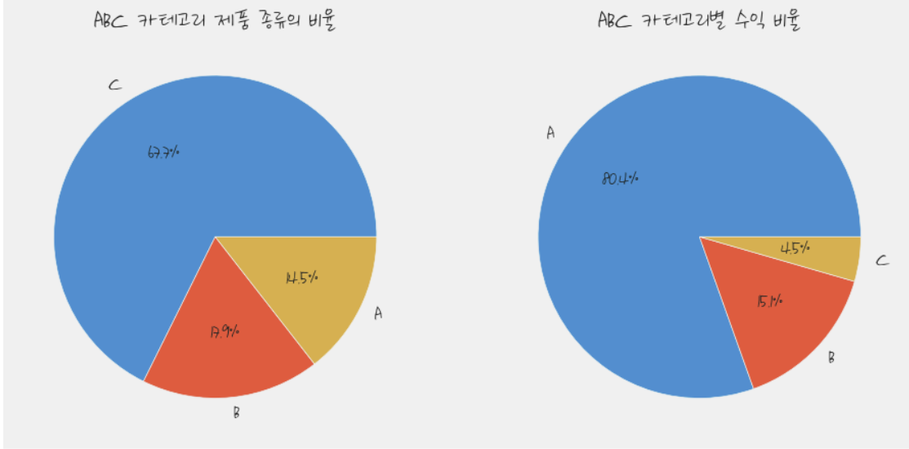
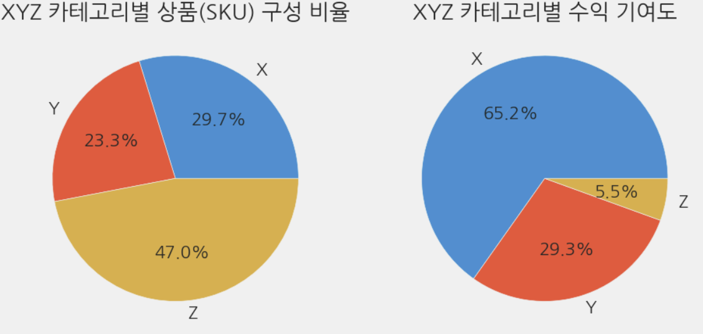
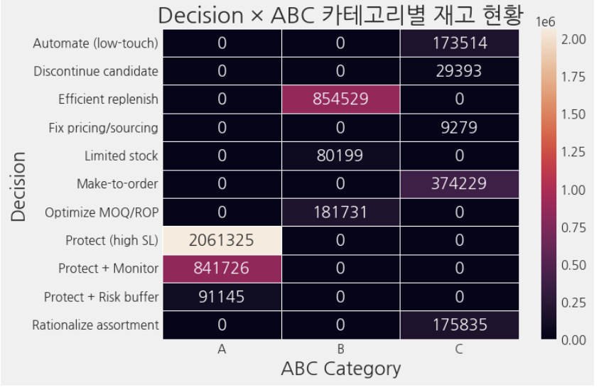
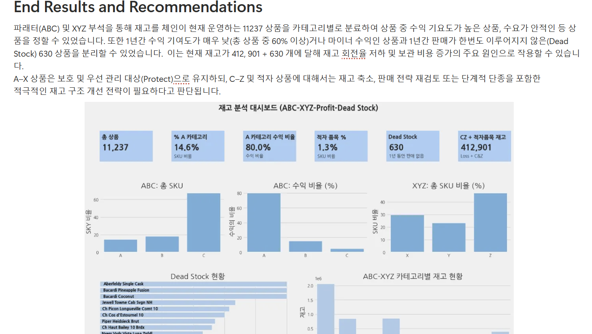

__# ABC–XYZ 분석을 활용한 재고 최적화 프로젝트__
## Dataset

분석에 사용한 데이터셋:

- [Inventory Analysis Case Study Dataset](https://www.kaggle.com/datasets/bhanupratapbiswas/inventory-analysis-case-study/data)

## 프로젝트 개요

본 프로젝트는 수익성(ABC 분석), 수요 변동성(XYZ 분석), **재고 상태(Dead Stock)**를 통합하여
재고 운영 현황을 구조적으로 분석하고, 실행 가능한 재고 전략을 도출하는 것을 목표로 합니다.

Python을 활용하여 상품(SKU)별 수익을 재계산하고,
수요 안정성과 재고 리스크를 분석하여 의사결정 매트릭스를 구축하였습니다.

자세한 설명은 아래 한국어 문서를 참고해 주세요:
- [재고 최적화: ABC 및 XYZ 분석](https://www.notion.so/ABC-XYZ-273daa9f0aca810f8df8eda345afdd6a?source=copy_link)

## 주요 목표

전체 수익을 창출하는 핵심 상품 식별

변동계수(CV)를 활용한 수요 안정성 평가

장기 미판매 및 저성과 상품 분리

상품(SKU) 단위의 재고 관리 전략 제안

## 사용 기술 및 분석 방법

Python: pandas, numpy

시각화: matplotlib, seaborn

분석 방법론:

수익 기여도 기반 ABC 분석

수요 변동성 기반 XYZ 분석

Dead Stock(1년간 미판매 상품) 식별

ABC–XYZ–수익 여부를 결합한 Decision Matrix

## 주요 결과

판매가 변동을 반영한 상품별 수익 재산출

모든 상품에 대한 ABC·XYZ 분류

재고 운영을 위한 전략적 의사결정 카테고리 도출

Python 기반 정적 대시보드 구축

Tableau 대시보드 확장을 고려한 구조 설계

## 향후 확장 계획

**비지도 학습(클러스터링)**을 활용한 상품 세분화

Tableau 인터랙티브 대시보드를 통한 매장·카테고리별 재고 모니터링

## 레포지토리 구조
├── notebooks/          # # EDA, ABC, XYZ, Decision Matrix 분석
├── figures/            # 시각화 결과
├── sql_queries/        # SQL queries for pre analysis stage
├── outputs/            # interactive Tableau dashboard 
├── README.md
├── README 한국어.md    #프로젝트 설명

## 결론

본 프로젝트는 복잡한 재고 데이터를 실무 중심의 의사결정 인사이트로 전환하여,
재고 효율성 개선과 수익성 중심의 재고 전략 수립을 지원하는 분석 프레임워크를 제시합니다.